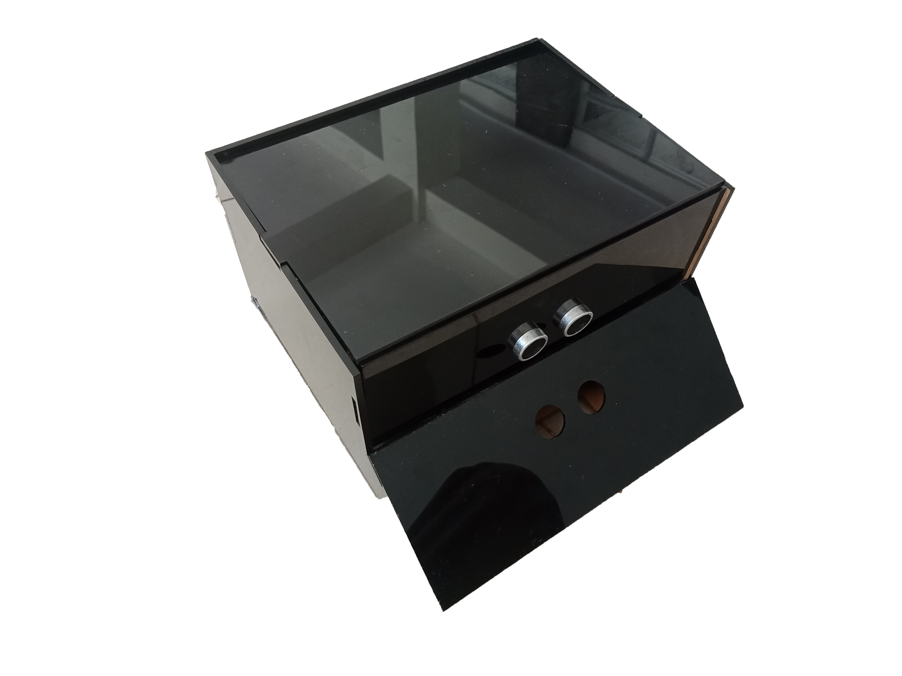

# Mini-Robot
Isi dari repositori ini adalah kode untuk robot berukuran kecil yang pernah saya dan tim buat.

## SapuRobot
Sapu robot merupakan robot pembersih ruangan yang pada dasarnya merupakan robot avoider dengan tambahan fitur berupa sapu ijuk kecil yang diletakkan didepannya sehingga dapat membawa debu dan sampah kecil yang ada didepannya.
Robot ini dilengkapi dengan 1 sensor berupa pembaca jarak yaitu sensor Ultrasonik.
Keunikan dari SapuRobot ini adalah penggunaan mikrokontroler berupa STM32F4 Discovery yang membuat pemrosesan berjalan lebih cepat 10x lipat dibanding menggunakan Arduino UNO

## SumoRobot
SumoRobot merupakan robot sumo versi 1 yang menggunakan IC BTNxxx. Inti dari kode ini adalah pembacaan sensor dan penggerakan aktuator berupa motor DC.
Robot ini dilengkapi dengan beberapa sensor, untuk pembacaan jarak menggunakan sensor Ultrasonik dan pembacaan garis luar arena berwarna putih menggunakan sensor Infared.
Penggerakan aktuator menggunakan metode PWM sehingga kecepatan dari motor DC dapat diatur.

## SumoRobot_V2
SumoRobot_V2 merupakan robot sumo versi 2 yang menggunakan IC L293D yaitu shield yang dirancang khusus untuk Arduino UNO.
Inti dari kode ini sama dengan versi sebelumnya yaitu SumoRobot.
Perubahan pada versi kedua ini adalah dengan penggunaan library **AFMotor** yang dapat mengontrol kecepatan dari motor DC yang dihubungkan dengan shieldnya.
Selain itu terdapat pula tambahan berupa fitur *controlled* yang memungkinkan pengguna dapat mengendalikan robot melalui aplikasi pada smartphone berupa **Bluetooth RC Controller**.

